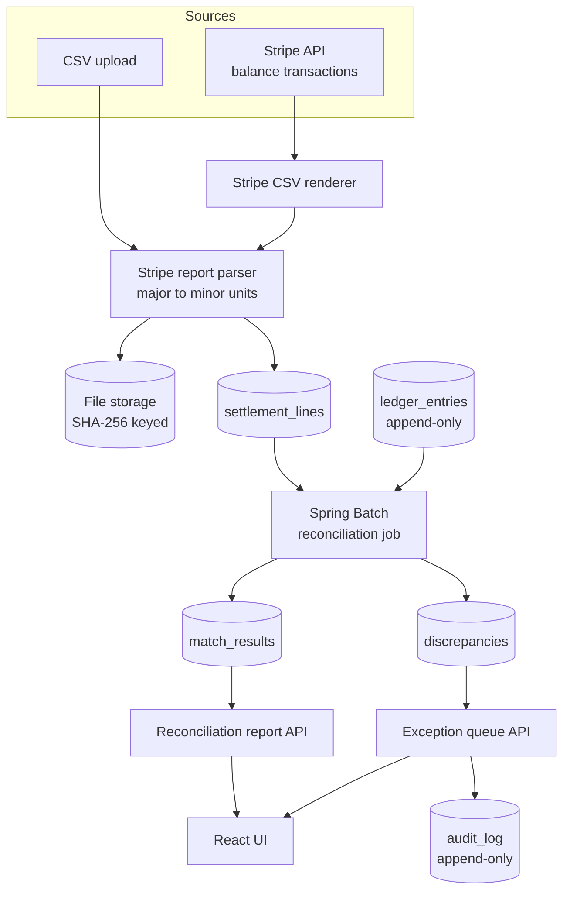
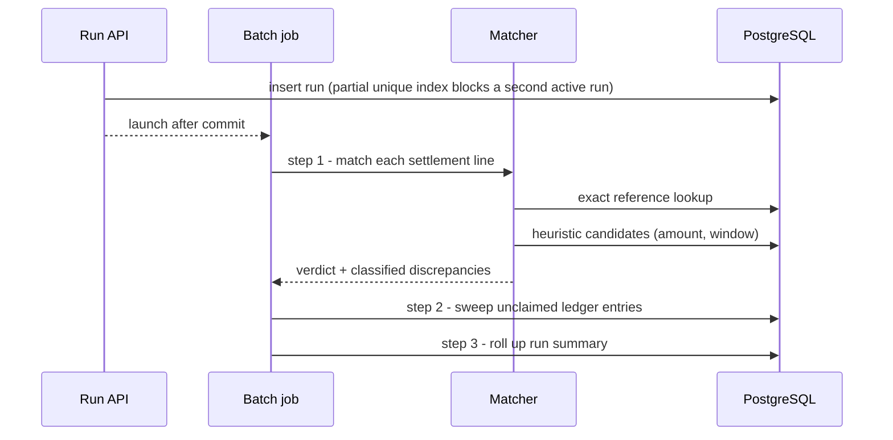

<div align="center">

  <h1>Settlement Reconciliation Engine</h1>

  <p><strong>Reconciles payment-provider payout files against an internal ledger, classifies every mismatch, and hands the remainder to a finance team as a worked exception queue.</strong></p>

  
  
  

  <br/>

  
  
  
  
  
  
  
  

</div>

---

> Every company that takes payments reconciles provider payouts against its own books, and most do
> it badly in spreadsheets. This service does it properly: thousands of transactions per file
> matched automatically, mismatches classified by cause rather than dumped in a list, and every
> money movement traceable back to the provider row it came from.

##  About

A payout file tells you what a payment provider actually moved. Your ledger tells you what you
think should have moved. Reconciliation is the work of explaining the gap — and the gap is where
lost money hides: a charge settled twice, a fee nobody booked, a payout that never arrived.

This engine ingests provider settlement files (modelled on Stripe's balance report), matches each
row against internal ledger entries, and classifies whatever fails to match into one of six causes.
What it cannot decide automatically becomes an exception queue item, presented with the provider's
version and the ledger's version side by side, so a finance analyst can resolve it with a recorded
reason.

The backend is standalone and has no dependency on the UI — it is designed to drop into another
system as a microservice. The React app exists to make the pipeline visible.

**What it is not:** a generic CRUD scaffold. The interesting parts are the correctness guarantees —
exact money arithmetic, idempotent re-ingestion, and database constraints that make double-booking
structurally impossible rather than merely unlikely.

##  Features

- **Exact money arithmetic** — amounts are minor units in `BIGINT` plus an ISO-4217 code. No `float`
  or `double` anywhere. `Money` refuses to combine currencies and throws on overflow instead of
  wrapping silently.
- **Idempotent file ingestion** — a settlement file is keyed by the SHA-256 of its bytes under a
  unique constraint. Re-uploading the same file returns the original record and writes nothing, so
  a retried upload cannot produce a second set of settlement lines.
- **Three-stage matching that degrades gracefully** — exact provider reference, then a scored
  heuristic on amount, date proximity and description, then a classified hand-off to a human. Every
  branch records *why* it landed there.
- **Six discrepancy classifications** — missing payout, missing ledger entry, amount drift,
  duplicate charge, unexpected fee, FX rounding. Each carries the money at stake and a written
  explanation.
- **Double-booking prevented by the database** — a partial unique index guarantees one ledger entry
  backs at most one settlement line per run. The second line claiming the same entry is what
  *produces* the duplicate-charge classification.
- **Append-only audit trail** — ledger entries, settlement lines, resolutions and the audit log
  reject `UPDATE` and `DELETE` at the database level via triggers. History cannot be rewritten by an
  application bug.
- **Exception queue with real authorization** — resolving requires a reason and is stamped with the
  authenticated user; writing an amount off requires an approver, not merely any analyst.
- **Optimistic locking on the queue** — two analysts cannot resolve the same item from stale screens.
- **Live Stripe or fully offline** — pull real balance transactions with a test-mode key, or generate
  reproducible payout files with known injected defects and no credentials at all.

##  Tech Stack

- **Backend:** Java 21, Spring Boot 4.1.0 (Framework 7, Security 7, Batch 6), Hibernate 7.4,
  springdoc-openapi 3.1
- **Database:** PostgreSQL 18, Flyway 13 migrations
- **Payments:** stripe-java 33.3 (optional, test mode), Apache Commons CSV 1.14
- **Frontend:** React 19.2, TypeScript 7, Vite 8, TanStack Query 5, React Router 7
- **Testing:** JUnit 5, Testcontainers 2.0, Spring Security Test, MockMvc
- **Tooling:** Maven Wrapper (3.9.16), Docker Compose

##  Architecture

Settlement data enters through one of two doors and immediately converges on a single path. The
live Stripe puller renders API results back into the report's CSV format rather than parsing them
separately, so pulled data gets the same checksum idempotency, the same stored artifact and the
same parser as an uploaded file — only one parser has to be trusted.



The matching job itself is three ordered steps. The order matters: the ledger sweep must run after
matching, because it is defined as *whatever matching did not claim*.



**Why fees are not swept as missing payouts:** a fee never arrives as its own settlement row. It is
deducted in the fee column of its charge's row, and is verified there against the booked `FEE`
ledger entry. Sweeping fees in step 2 would report every ordinary fee as a discrepancy.

##  Project Structure

```
.
├── backend/                       # Spring Boot service, standalone
│   └── src/main/java/com/reconengine/
│       ├── audit/                 # append-only trail: who did what, when, why
│       ├── auth/                  # JWT issuance, login throttle, current actor
│       ├── common/                # Money, typed errors, ProblemDetail handler
│       ├── config/                # security chain, validated properties, clock
│       ├── exceptionqueue/        # queue workflow, resolutions, manual linking
│       ├── ledger/                # immutable internal ledger of orders/refunds/fees
│       ├── provider/
│       │   ├── generator/         # reproducible scenarios with injected defects
│       │   └── stripe/            # report parser, CSV renderer, live API client
│       ├── recon/
│       │   ├── batch/             # Spring Batch job, steps, tasklets
│       │   └── matching/          # exact then heuristic matcher, classification
│       ├── report/                # per-run summary and drill-down
│       ├── settlement/            # file ingestion, checksums, provider rows
│       └── user/                  # roles mapped to fine-grained permissions
│   └── src/main/resources/db/migration/
│       ├── V1__spring_batch_schema.sql
│       └── V2__core_schema.sql    # constraints, partial indexes, append-only triggers
├── frontend/                      # React SPA, consumes the REST API only
│   └── src/
│       ├── api/                   # typed fetch client, RFC 9457 error handling
│       ├── auth/                  # token storage and permission checks
│       └── pages/                 # files & runs, run report, exception queue
└── docker-compose.yml             # PostgreSQL 18
```

##  Getting Started

### Prerequisites

| Requirement | Version | Notes |
|---|---|---|
| JDK | 21+ | Maven Wrapper supplies Maven itself |
| Docker | any recent | PostgreSQL, and required by the integration tests |
| Node.js | `^20.19` or `>=22.12` | frontend only; required by Vite 8 |

### Installation

```bash
docker compose up -d          # PostgreSQL 18 on :5432
cd frontend && npm install
```

Flyway applies both migrations automatically on first backend start.

### Running

```bash
# Backend — http://localhost:8080, Swagger UI at /swagger-ui.html
cd backend && ./mvnw spring-boot:run

# Frontend — http://localhost:5173 (proxies /api to :8080)
cd frontend && npm run dev
```

Seeded accounts, all with password `recon-demo-2026`:

| User | Role | May |
|---|---|---|
| `analyst` | `FINANCE_ANALYST` | upload files, trigger runs, resolve exceptions |
| `approver` | `FINANCE_APPROVER` | the above, plus write exceptions off |
| `admin` | `ADMIN` | the above, plus post ledger entries and seed demo data |

> Set `SEED_USERS=false` and a real `JWT_SECRET` for any deployment that is not a local demo.

##  Usage

The fastest path to a populated exception queue, no Stripe credentials needed:

1. Sign in as `admin`.
2. **Generate demo scenario.** One plan produces both the internal ledger and the provider file,
   with a known set of defects injected into the provider side. Because the plan is seeded, the same
   seed always yields the same file — so the discrepancies the engine finds can be checked against
   the discrepancies that were planted.
3. **Reconcile.** The batch job matches every provider row, sweeps the ledger for money the provider
   never settled, and rolls the verdicts up.
4. **Report.** Match rate, money accounted for versus outstanding, breakdown by classification, and
   drill-down to the unmatched rows.
5. **Exception queue.** Resolve items with a recorded reason; try `WRITE_OFF` as `analyst` to see
   the approver-only permission refuse it.

The same flow over HTTP:

```bash
TOKEN=$(curl -s localhost:8080/api/v1/auth/login \
  -H 'Content-Type: application/json' \
  -d '{"username":"admin","password":"recon-demo-2026"}' | jq -r .accessToken)

FILE=$(curl -s localhost:8080/api/v1/demo/scenario \
  -H "Authorization: Bearer $TOKEN" -H 'Content-Type: application/json' \
  -d '{"transactions":500,"seed":20260812,"currency":"USD","missingPayouts":6,
       "missingLedgerEntries":4,"amountDrifts":5,"fxRoundings":8,
       "duplicateCharges":3,"unexpectedFees":4,"heuristicOnly":25}' | jq -r .file.id)

RUN=$(curl -s -X POST "localhost:8080/api/v1/runs?fileId=$FILE" \
  -H "Authorization: Bearer $TOKEN" | jq -r .id)

curl -s "localhost:8080/api/v1/runs/$RUN/report" -H "Authorization: Bearer $TOKEN" | jq
```

Uploading a real provider file instead:

```bash
curl -X POST 'localhost:8080/api/v1/settlement-files?provider=STRIPE' \
  -H "Authorization: Bearer $TOKEN" -F 'file=@payout.csv'
```

### Discrepancy classifications

| Type | Meaning |
|---|---|
| `MISSING_PAYOUT` | We booked the money; the provider never settled it. |
| `MISSING_LEDGER_ENTRY` | The provider settled money we have no record of. |
| `AMOUNT_DRIFT` | Both sides have the transaction but disagree on the amount beyond tolerance. |
| `FX_ROUNDING` | Sub-tolerance difference consistent with currency rounding. |
| `DUPLICATE_CHARGE` | One source object settled twice in a single file. |
| `UNEXPECTED_FEE` | A fee was deducted that was never booked, or booked at a different amount. |

##  API Reference

Full interactive documentation is served at `/swagger-ui.html`. Every endpoint except login is
deny-by-default and requires a bearer token.

| Method | Endpoint | Permission | Description |
|---|---|---|---|
| `POST` | `/api/v1/auth/login` | public | Exchange credentials for a bearer token |
| `GET` | `/api/v1/auth/me` | authenticated | Describe the caller behind the current token |
| `POST` | `/api/v1/settlement-files` | `file:upload` | Upload a payout file; identical bytes are a no-op |
| `GET` | `/api/v1/settlement-files` | `file:read` | List ingested files, newest first |
| `GET` | `/api/v1/settlement-files/{id}/lines` | `file:read` | Drill down to raw provider rows |
| `POST` | `/api/v1/runs?fileId=` | `run:trigger` | Start reconciling a parsed file (returns `202`) |
| `GET` | `/api/v1/runs/{id}` | `run:read` | Poll status and headline counters |
| `GET` | `/api/v1/runs/{id}/report` | `run:read` | Full reconciliation report |
| `GET` | `/api/v1/runs/{id}/unmatched-lines` | `run:read` | Provider rows the run could not account for |
| `GET` | `/api/v1/exceptions` | `exception:read` | Work the queue, filtered by status/type/severity |
| `GET` | `/api/v1/exceptions/{id}` | `exception:read` | Both sides of the money plus decision history |
| `POST` | `/api/v1/exceptions/{id}/claim` | `exception:resolve` | Take an item for review |
| `POST` | `/api/v1/exceptions/{id}/resolve` | `exception:resolve` | Record a decision (`WRITE_OFF` needs `exception:write_off`) |
| `POST` | `/api/v1/ledger/entries` | `ledger:write` | Post an immutable ledger entry |
| `POST` | `/api/v1/ledger/entries/batch` | `ledger:write` | Post many; duplicates are counted, not rejected |
| `GET` | `/api/v1/ledger/entries` | `ledger:read` | Search the internal ledger |
| `GET` | `/api/v1/audit` | `audit:read` | Read the audit trail, optionally scoped to one entity |
| `POST` | `/api/v1/demo/scenario` | `ledger:write` | Seed a reproducible ledger and payout file |
| `POST` | `/api/v1/stripe/pull?from=&to=` | `file:upload` | Pull live balance transactions (`503` if unconfigured) |

Errors are RFC 9457 problem details carrying a stable machine-readable `code`:

```json
{
  "type": "about:blank",
  "status": 409,
  "detail": "A reconciliation run for file 9f3c… is already pending or running.",
  "code": "RUN_ALREADY_ACTIVE"
}
```

##  Configuration

| Variable | Description | Default | Required |
|---|---|---|---|
| `DB_URL` | JDBC URL for PostgreSQL | `jdbc:postgresql://localhost:5432/recon` | No |
| `DB_USER` | Database user | `recon` | No |
| `DB_PASSWORD` | Database password | `recon` | No |
| `JWT_SECRET` | HS256 signing key, minimum 32 characters | dev-only placeholder | **Yes in production** |
| `STORAGE_ROOT` | Where uploaded payout files are kept | `./data/settlement-files` | No |
| `SEED_USERS` | Create the demo finance users on an empty database | `true` | No |
| `SEED_PASSWORD` | Password given to seeded users | `recon-demo-2026` | No |
| `CORS_ORIGINS` | Allowed browser origins | `http://localhost:5173` | No |
| `STRIPE_ENABLED` | Enable the live Stripe puller | `false` | No |
| `STRIPE_API_KEY` | Stripe secret key, test mode is fine | empty | Only if enabled |

<details>
<summary>Matching tuning (application.yml, no env override)</summary>

| Property | Description | Default |
|---|---|---|
| `app.matching.date-window` | How far apart a ledger entry and a settlement line may be and still be the same event | `PT72H` |
| `app.matching.amount-tolerance-minor` | Difference treated as FX rounding rather than real drift | `2` |
| `app.matching.min-heuristic-confidence` | Score below which a heuristic candidate is not accepted | `0.70` |

The heuristic score weights amount agreement at 0.6, date proximity within the window at 0.3, and
whether the provider's description names the ledger reference at 0.1.

</details>

##  Testing

```bash
cd backend && ./mvnw test          # unit + integration
cd frontend && npm run typecheck   # strict TypeScript, no emit
```

Integration tests run against a real PostgreSQL through Testcontainers rather than an in-memory
database, because the constraints, partial unique indexes and append-only triggers *are* the thing
under test — H2 would not enforce them. **Docker must be running.**

| Suite | Covers |
|---|---|
| `MoneyTest` | Fraction digits per currency (JPY, BHD), overflow, currency mixing |
| `StripeCsvParserTest` | Major-to-minor conversion, sub-cent refusal, broken `net` identity, reordered columns |
| `SettlementIngestIT` | Byte-identical re-upload is a no-op; unparseable files rejected with a readable code |
| `ReconciliationPipelineIT` | End-to-end run against a scenario with known defects; each classification must match the count planted |
| `ExceptionQueueSecurityIT` | Anonymous rejection, invalid tokens, `ledger:write` restriction, approver-only write-off, mandatory reason |

##  Contributing

1. Branch from `main`.
2. Keep money in minor units and let database constraints — not application checks — decide races.
3. Add or update tests for behaviour you change; integration tests need Docker.
4. Run `./mvnw test` and `npm run build` before opening a pull request.

##  License

MIT — see [LICENSE](LICENSE).
